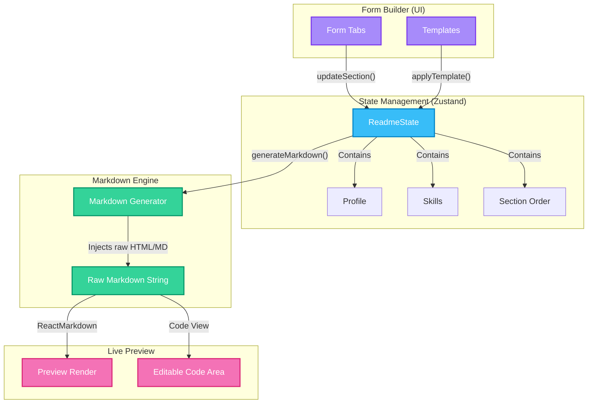
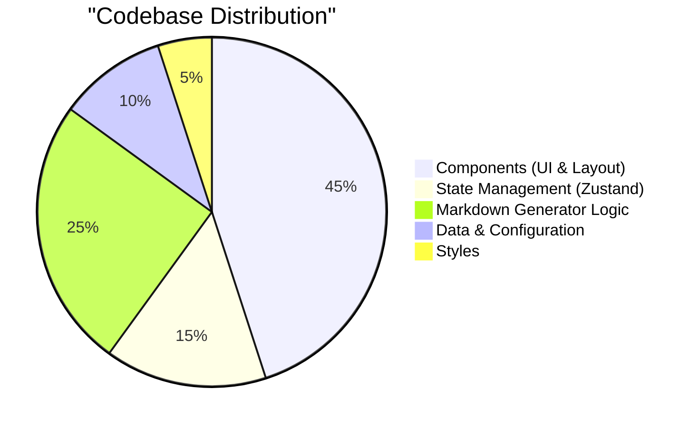

<div align="center">
  
# 🚀 Readme Builder

**A modern, intuitive, and visually stunning GitHub Profile README generator.**

[](https://nextjs.org/)
[](https://react.dev/)
[](https://www.typescriptlang.org/)
[](https://tailwindcss.com/)
[](https://zustand-demo.pmnd.rs/)

[Features](#-key-features) • [Tech Stack](#-tech-stack) • [Architecture](#-architecture--data-flow) • [Getting Started](#-getting-started) • [Contributing](#-contributing)

</div>

---

## 📖 Overview

**Readme Builder** is a powerful web application designed to help developers craft beautiful, professional, and dynamic GitHub Profile READMEs without manually writing complex Markdown or HTML. 

With a live-syncing preview, a drag-and-drop section order panel, and a massive library of tech stack badges and GitHub stats widgets, your profile will stand out in minutes.

---

## ✨ Key Features

- 🎨 **Glassmorphism UI**: A stunning, modern interface with fluid animations powered by Framer Motion.
- ⚡ **Real-time Live Sync**: See your Markdown render instantly in a true GitHub-styled preview pane.
- 📦 **Templates Gallery**: Jumpstart your profile with pre-built templates (Open Source, Portfolio, Data Science, etc.).
- 🛠️ **Elements Library**: Easily inject animated typing SVGs, contribution snakes, and dynamic GitHub stats cards.
- 🌙 **Theme Support**: Seamless Light/Dark mode transitions.
- 🧩 **Modular Sections**: Reorder your README sections (Profile, Skills, Social, etc.) visually.
- 💾 **Auto-Save & Share**: Your progress is auto-saved locally, and you can generate a shareable URL to collaborate.

---

## 💻 Tech Stack

| Category | Technologies |
| :--- | :--- |
| **Framework** | Next.js 15 (App Router), React 19 |
| **Styling** | Tailwind CSS v4, Custom CSS Variables |
| **State Management** | Zustand (with persistent local storage) |
| **Markdown parsing** | `react-markdown`, `remark-gfm`, `rehype-raw` |
| **Animations** | Framer Motion |
| **Tooling** | Turbopack, ESLint, TypeScript |

---

## 🏗️ Architecture & Data Flow

The application relies on a strictly typed, one-way data flow architecture using Zustand to maintain consistency between the Form Builder and the live Markdown generator.



---

## 📊 Application Structure



---

## 🚀 Getting Started

Follow these instructions to get a copy of the project up and running on your local machine.

### Prerequisites

Ensure you have the following installed:
- [Node.js](https://nodejs.org/) (v18.x or later)
- npm or yarn

### Installation

1. **Clone the repository:**
   ```bash
   git clone https://github.com/your-username/Readme_Builder.git
   cd Readme_Builder
   ```

2. **Install dependencies:**
   ```bash
   npm install
   ```

3. **Start the development server:**
   ```bash
   npm run dev
   ```
   *Note: This project uses Turbopack for lightning-fast HMR.*

4. **Open the app:**
   Navigate to [http://localhost:3000](http://localhost:3000) in your browser.

---

## 📁 Project Structure

```text
Readme_Builder/
├── src/
│   ├── app/                 # Next.js App Router (page.tsx, layout.tsx, globals.css)
│   ├── components/          # Reusable React Components
│   │   ├── builder/         # Core builder logic (QuickInsertBar, SectionOrder)
│   │   ├── layout/          # Major layout panels (Header, FormPanel, PreviewPanel)
│   │   ├── tabs/            # Individual form sections (Profile, About, Skills)
│   │   └── ui/              # Shadcn UI primitives (Buttons, Tabs, Progress)
│   ├── data/                # Static data arrays (Skills list, Badges, Templates)
│   ├── hooks/               # Custom React hooks (useDebouncedValue)
│   ├── lib/                 # Core utilities (generateMarkdown.ts, utils.ts)
│   ├── store/               # Zustand state stores
│   └── types/               # Global TypeScript definitions
├── public/                  # Static assets
└── tailwind.config.ts       # Tailwind styling configuration
```

---

## 🤝 Contributing

Contributions are what make the open source community such an amazing place to learn, inspire, and create. Any contributions you make are **greatly appreciated**.

1. Fork the Project
2. Create your Feature Branch (`git checkout -b feature/AmazingFeature`)
3. Commit your Changes (`git commit -m 'Add some AmazingFeature'`)
4. Push to the Branch (`git push origin feature/AmazingFeature`)
5. Open a Pull Request

---

## 📄 License

Distributed under the MIT License. See `LICENSE` for more information.

---

<div align="center">
  <b>Built with ❤️ using Next.js & React</b>
</div>
